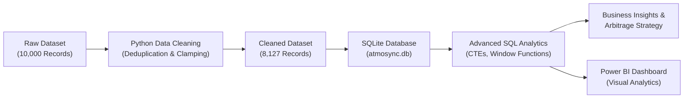

# 📊 AtmoSync: Micro-Climate Arbitrage Analytics & SQL Insights Pipeline


---

## 📌 Executive Summary

**AtmoSync** is an end-to-end Data Analytics project investigating hyper-local micro-climate variations (Temperature, Humidity, Rainfall, Air Quality Index) and their direct impact on retail sales velocity, dynamic pricing arbitrage, and stockout revenue leakage across **5 major NCR cities** (*Delhi, Gurugram, Noida, Ghaziabad, Faridabad*).

Evaluating **8,127 cleaned observations** across 20 micro-zones from January 1, 2026 to August 31, 2026, this repository demonstrates advanced SQL techniques, SQLite database modeling, Python ETL automation, and interactive business insights discovery.

---

## 🔄 Analytics Pipeline Architecture



---

## 📈 Key Performance Indicators (Executive Summary)

| Category | KPI Metric | Value | Business Impact |
| :--- | :--- | :--- | :--- |
| 💰 **Financial** | **Total Generated Revenue** | **₹40,33,00,135.57** (₹40.33 Cr) | Gross revenue generated across 5 product categories |
| ⚠️ **Financial** | **Total Lost Revenue** | **₹33,20,620.38** (₹33.20 Lakhs) | Unfulfilled demand lost due to micro-zone stockouts |
| 📦 **Volume** | **Total Units Sold** | **5,475,303 Units** | 673.72 average units sold per observation |
| ❌ **Volume** | **Unfulfilled Lost Units** | **44,102 Units** | Stockout volume leakage across peak demand periods |
| 📊 **Operations** | **Overall Stockout Rate** | **13.77%** | 1,119 stockout events out of 8,127 records |
| 🏷️ **Pricing** | **Avg Selling Price** | **₹73.78 / Unit** | vs Competitor Avg Price of ₹71.81 (+₹1.97 premium) |
| 💡 **Arbitrage** | **Pricing Headroom Upside** | **₹34,19,528.76** | Headroom from matching competitor price during heatwaves |

---

## 💡 Top Business Insights (Interactive Breakdown)

<details>
<summary><b>🔥 Insight 1: May-June Heatwave Peak Season (Click to expand)</b></summary>
<br>

- **Finding**: May 2026 reached peak monthly revenue of **₹6,68,48,776.42** (+17.97% MoM growth) when average temperatures reached 35.86°C and Micro-Climate Score averaged 72.34.
- **Combined Impact**: May and June contributed **₹12,35,66,602.51** (30.6% of annual revenue).
- **Takeaway**: Temperature spikes above 35°C exponentially increase beverage and ice cream demand.

</details>

<details>
<summary><b>📦 Insight 2: Stockout Penalty Concentration (Click to expand)</b></summary>
<br>

- **Finding**: 50.2% of all unfulfilled revenue losses occurred in just 2 categories:
  1. **Ice Cream**: ₹8,51,436.70 lost revenue (25.6% of total lost revenue).
  2. **Cold Drinks**: ₹8,15,819.16 lost revenue (24.6% of total lost revenue).
- **Takeaway**: Shifting safety stock by 15% toward Ice Cream and Cold Drinks during summer months recovers over ₹16.6 Lakhs in lost revenue.

</details>

<details>
<summary><b>📍 Insight 3: Micro-Zone Stockout Risk Clusters (Click to expand)</b></summary>
<br>

- **Finding**: Top 3 vulnerable zones account for ₹6.03 Lakhs in unfulfilled sales:
  1. **Sector 150 (Noida)**: ₹2,08,789.97 lost revenue (14.79% stockout rate).
  2. **South Delhi (Delhi)**: ₹2,04,150.39 lost revenue (16.55% stockout rate).
  3. **Cyber City (Gurugram)**: ₹1,90,472.20 lost revenue (13.76% stockout rate).
- **Takeaway**: Corporate hubs and high-density residential nodes require automated weekend replenishment pushes.

</details>

<details>
<summary><b>🌧️ Insight 4: Weather Sensitivity Volatility (Click to expand)</b></summary>
<br>

- **Finding**: Rainy days cause a **50.2% revenue drop** (Avg daily revenue: ₹32,975.72) compared to Hot & Sunny days (Avg daily revenue: ₹66,270.60).
- **Takeaway**: Purchasing algorithms must automatically reduce perishable stocking 24 hours prior to forecasted rain.

</details>

<details>
<summary><b>📅 Insight 5: Weekend Demand Surge (Click to expand)</b></summary>
<br>

- **Finding**: Sunday and Saturday sales average 734 and 724 units/day (**12.6% higher than weekday averages**).
- **Takeaway**: Mandatory Friday evening restocking prevents weekend inventory depletion.

</details>

---

## 🛠️ Advanced SQL Techniques Demonstrated

<details>
<summary><b>🔍 1. Window Functions (DENSE_RANK & Running Totals)</b></summary>
<br>

```sql
-- Rank micro-zones within each city by revenue using DENSE_RANK()
WITH ZoneRevenue AS (
    SELECT City, Zone, SUM(Revenue_INR) AS total_revenue_inr
    FROM atmosync_data GROUP BY City, Zone
)
SELECT City, Zone, total_revenue_inr,
       DENSE_RANK() OVER (PARTITION BY City ORDER BY total_revenue_inr DESC) AS revenue_rank
FROM ZoneRevenue;
```
</details>

<details>
<summary><b>📊 2. Common Table Expressions (CTEs) for Arbitrage Matrix</b></summary>
<br>

```sql
WITH ClimatePriceMatrix AS (
    SELECT Date, City, Zone, Product_Category, Micro_Climate_Score, Demand_Index,
           CASE 
               WHEN Micro_Climate_Score >= 65.0 AND Avg_Price_INR <= Competitor_Price_INR THEN 'Q1: High Demand / Underpriced'
               WHEN Micro_Climate_Score >= 65.0 AND Avg_Price_INR > Competitor_Price_INR THEN 'Q2: High Demand / Premium Priced'
               ELSE 'Q3: Normal Operations'
           END AS arbitrage_segment
    FROM atmosync_data
)
SELECT arbitrage_segment, COUNT(*) AS count, SUM(Revenue_INR) AS revenue
FROM ClimatePriceMatrix GROUP BY arbitrage_segment;
```
</details>

---

## 📂 Repository Directory Layout

```
Atmosync-microclimate-arbitrage-analytics/
│
├── data/
│   ├── atmosync.db                     # SQLite database file
│   └── clean_data.csv                  # Cleaned dataset (8,127 records)
│
├── sql/
│   ├── 02_create_tables.sql            # Table DDL & performance indexes
│   ├── 03_data_overview.sql            # Profiling & row counts
│   ├── 04_data_quality.sql             # NULL & range check validation
│   ├── 05_basic_kpis.sql               # Executive KPIs & summary metrics
│   ├── 06_category_analysis.sql        # Share of wallet & weather matrix
│   ├── 07_top_bottom_analysis.sql     # Top/bottom micro-zone rankings
│   ├── 08_time_trend_analysis.sql     # Monthly trends & day-of-week sales
│   ├── 09_distribution_segmentation.sql # Temp buckets & CASE WHEN segments
│   ├── 10_subqueries_and_ctes.sql      # CTEs & arbitrage headroom models
│   ├── 11_window_functions_and_anomalies.sql # DENSE_RANK & running totals
│   └── 12_insights_queries.sql         # Final business decision queries
│
├── insights/
│   └── insights_report.md              # Executive Insights Report
│
├── scripts/
│   └── import_data.py                  # Database import helper script
│
├── clean_data.py                       # Automated cleaning pipeline script
└── README.md                           # Main interactive project documentation
```

---

## ⚡ Quick Start & Reproduction Steps

1. **Clone the Repository**:
   ```bash
   git clone https://github.com/svasantha633/Atmosync-microclimate-arbitrage-analytics.git
   cd Atmosync-microclimate-arbitrage-analytics
   ```

2. **Run Ingestion & Create SQLite Database**:
   ```bash
   python scripts/import_data.py
   ```

3. **Execute SQL Analytics**:
   ```bash
   python -c "import sqlite3, pandas as pd; conn = sqlite3.connect('data/atmosync.db'); print(pd.read_sql_query('SELECT COUNT(*) FROM atmosync_data', conn))"
   ```

---

## 👤 Author & Contribution

- **Data Analyst / SQL Pipeline**: Tahseen Parvej ([Branch `Tahseen_Parvej`](https://github.com/svasantha633/Atmosync-microclimate-arbitrage-analytics/tree/Tahseen_Parvej))
- **Team Repository**: [svasantha633/Atmosync-microclimate-arbitrage-analytics](https://github.com/svasantha633/Atmosync-microclimate-arbitrage-analytics)